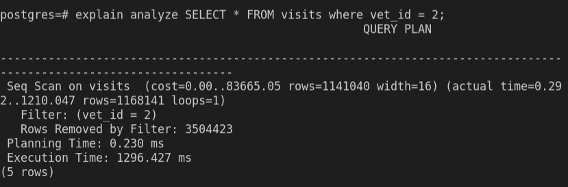
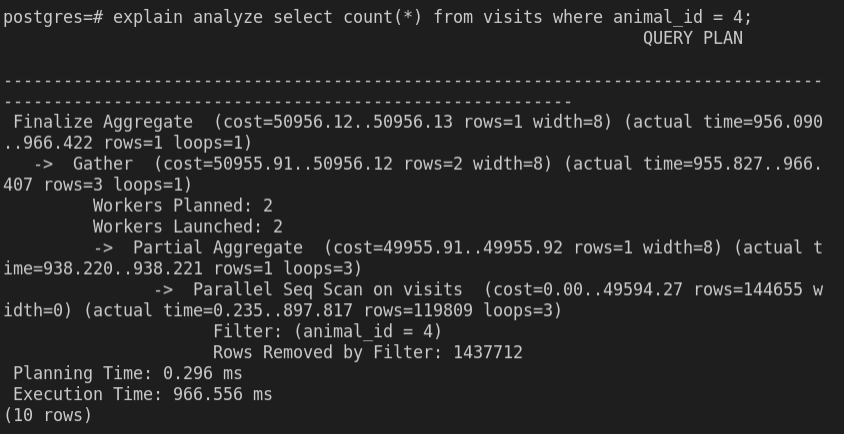
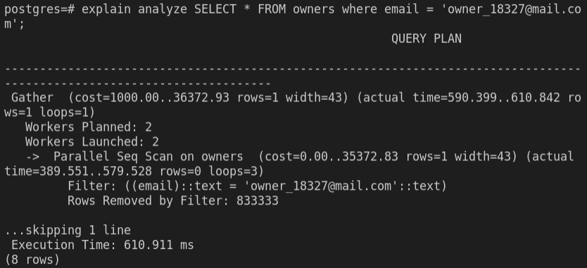
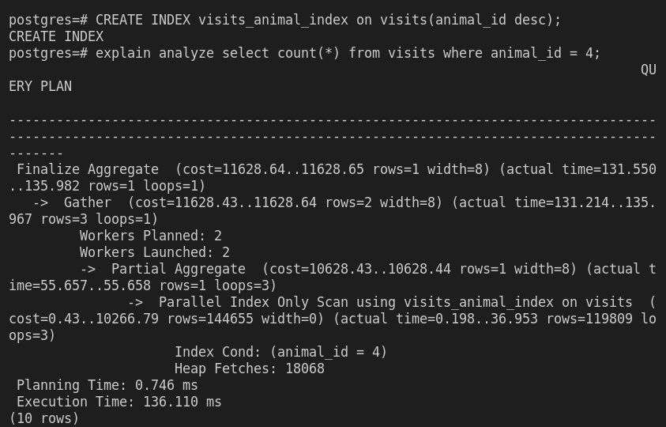
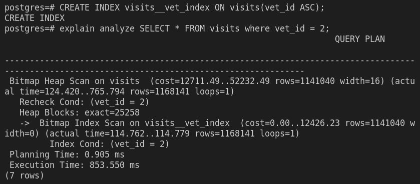
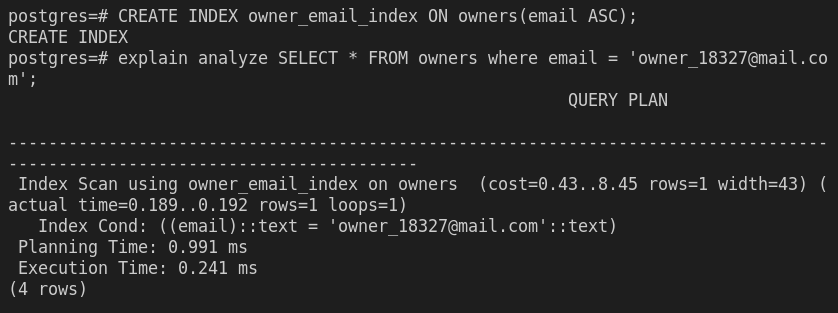

# Vet-database audit

This is an audit of a vet database using the command EXPLAIN ANALYZE of Postgresql. Performance time was improved adding indexes.

## Getting Started

This repository includes files with plain SQL that can be used to recreate a database:

- Use [schema.sql](./schema.sql) to create all tables.
- Use [data.sql](./data.sql) to populate tables with sample data.
- Check [queries.sql](./queries.sql) for examples of queries that can be run on a newly created database.

 **Important note: this file might include queries that make changes in the database (e.g., remove records). Use them responsibly!**

## Set Up

Docker is advised for this project.

Create a directory to store docker volumes

`mkdir -p $HOME/docker/volumes/pg_db_perf_audit`

Create an user and volumes for the audit

`docker run --name pg_db_perf_audit -e POSTGRES_PASSWORD=postgres -d -p 54321:5432 -v $HOME/docker/volumes/pg_db_perf_audit:/var/lib/postgresql/data postgres`

Copy files to recreate the database (replace PATH/SQL_FILES with your path )

`docker cp\ [PATH/SQL_FILES] pg_db_perf_audit:/tmp`

Start docker:

`docker exec -it pg_db_perf_audit bash`

You can run sql files with this syntax:

`psql -Upostgres -fFILENAME.sql `

Go into database with `psql -Upostgres`

### Useful postgres commands

- `postgres=# \dt` : List tables
- `postgres=# \dt EXPLAIN ANALYZE [Query]` Analyze a query performance

## Test performance

Three queries were tested, showing the following results.

`EXPLAIN ANALYZE SELECT * FROM visits where vet_id = 2;`

`EXPLAIN ANALYZE SELECT COUNT(*) FROM visits where animal_id = 4;`

`EXPLAIN ANALYZE SSELECT * FROM owners where email = 'owner_18327@mail.com';`

## Performance improved

Index were created for improving performance. 

- First query:

- Second query:

- Third query:

## Authors

👤 **Juan Paulo Perez-Tejada**

- GitHub: [@Maclenn77](https://github.com/Maclenn77)
- Twitter: [@SrJuanPapas](https://twitter.com/SrJuanPapas)
- LinkedIn: [LinkedIn](https://linkedin.com/in/juanpaulopereztejada)

## 🤝 Contributing

Contributions, issues, and feature requests are welcome!

Feel free to check the [issues page](../../issues/).

## Show your support

Give a ⭐️ if you like this project!

## Acknowledgments

- Hat tip to anyone whose code was used
- Inspiration
- etc

## 📝 License

This project is [MIT](./MIT.md) licensed.
